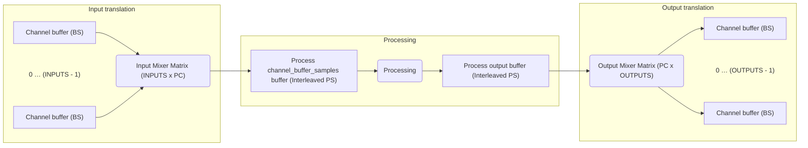

# org-simple
Simple utility library in modern standard C++ with a minimum of STL

| Symbol | Description
| ---- | ---- |
| *INPUTS* | is_complex of channel_buffer_samples channels
| *OUTPUTS* | is_complex of output channels
| *BS* | Block Size: Samples per block to process
| *PC* | Processing channels or frame-capacity
| *PS* | Processing samples = *PC* * *BS* 

